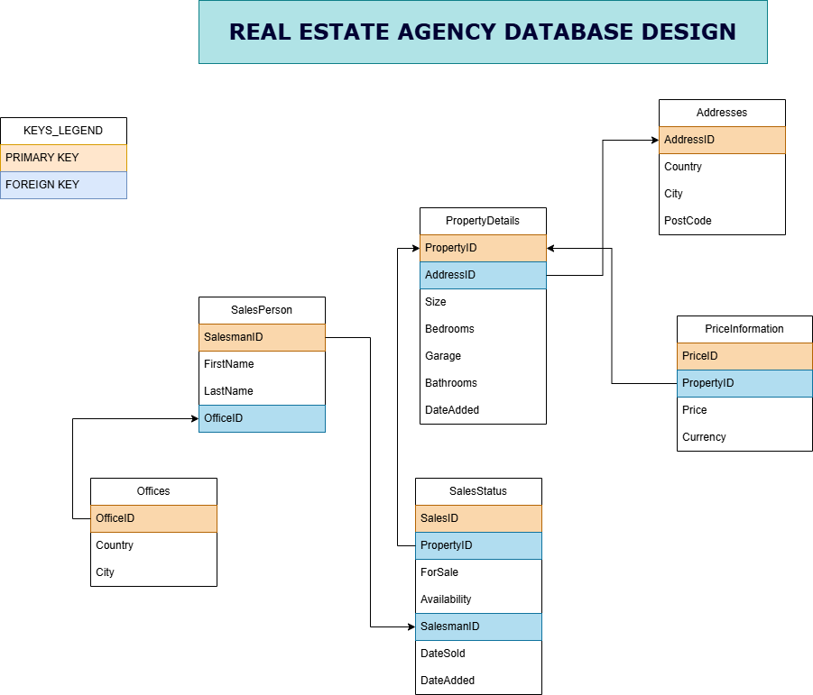
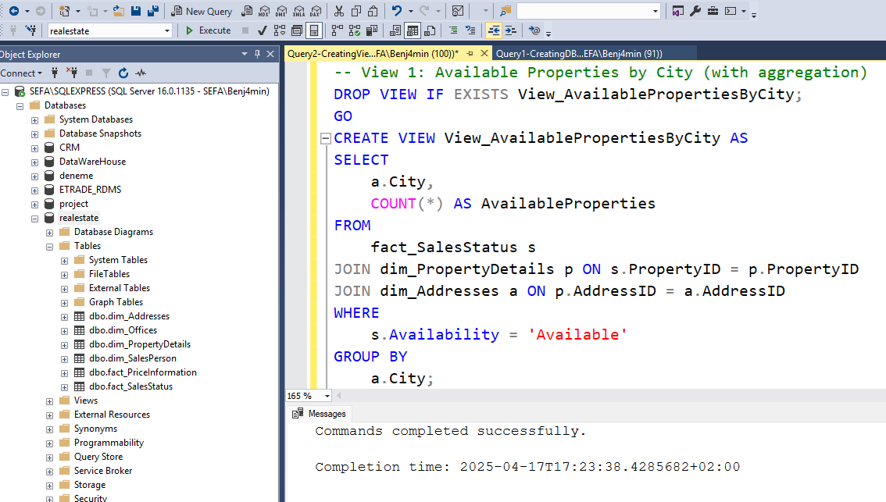
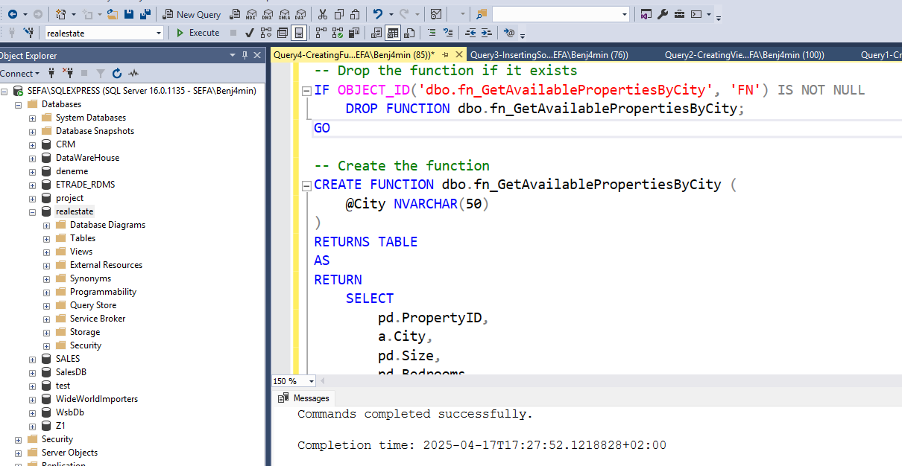
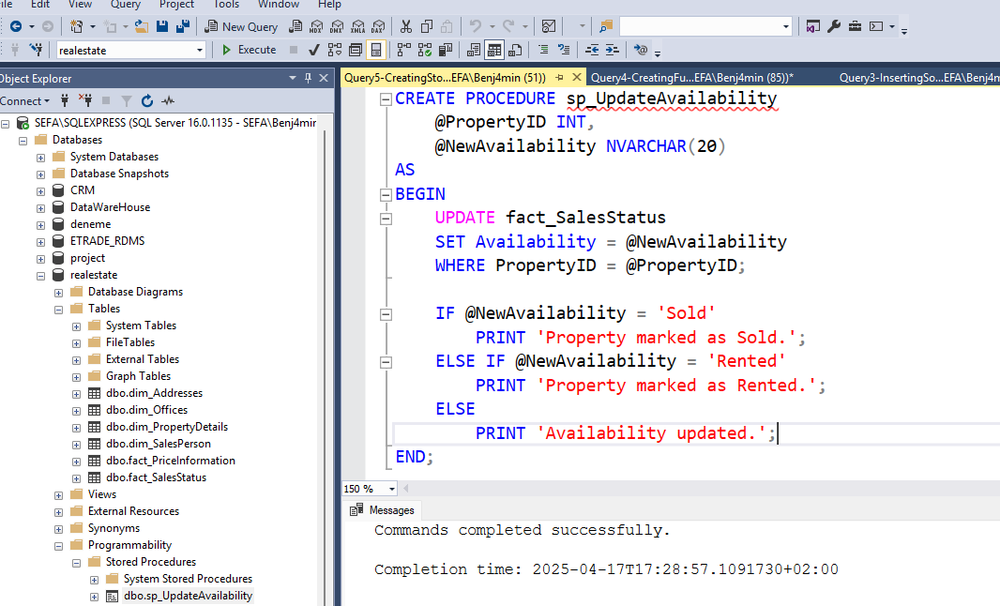
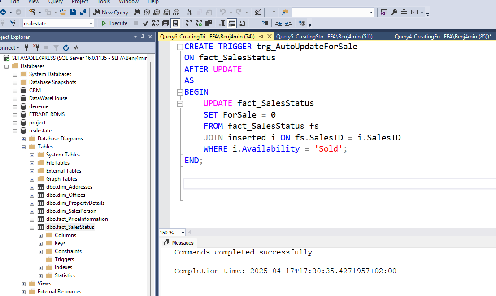

# 🏡 Real Estate Agency Database Project

This project is a comprehensive **relational database design** for a real estate agency operating across multiple cities and countries. It includes schema creation, views, stored procedures, a user-defined function, and a trigger to demonstrate a real-world data environment and business logic implementation.

---

## 📚 Project Overview

- **Goal:** Efficiently store, manage, and analyze data about properties, locations, prices, availability, and sales team performance.
- **Tech Stack:** Microsoft SQL Server (T-SQL)
- **Use Cases:** Internal analytics, availability dashboards, performance reporting, and potential expansion for customer portals or CRM integration.

---

## 🧱 Database Schema

### ✅ Dimension Tables

| Table              | Description                                  |
|-------------------|----------------------------------------------|
| `dim_Addresses`    | Stores country, city, and postal codes       |
| `dim_Offices`      | Agency office locations                      |
| `dim_SalesPerson`  | Sales team members and office associations   |
| `dim_PropertyDetails` | Core property specs like size, rooms, etc. |

### 📊 Fact Tables

| Table                 | Description                                   |
|----------------------|-----------------------------------------------|
| `fact_PriceInformation` | Tracks property pricing and currency       |
| `fact_SalesStatus`      | Tracks status: sold, rented, or available  |

### Diagram
   
  

```md
Real-Estate-Agency-DB/
├── visuals/
│   ├── diagram/
│   │   ├── RealEstateAgencyDbDesign.png
│   │   └── RealEstateAgencyDbDesignLight.png
│   └── screenshots/
│       ├── Screenshot-CreateDBandCreateTables.png
│       ├── Screenshot-CreateFunction.png
│       ├── Screenshot-CreateTrigger.png
│       ├── Screenshot-CreateViews.png
│       ├── Screenshot-CreatingStoredProcedures.png
│       ├── Screenshot-InsertingSampleData.png
├── README.md
└── 
```

---

## 🔍 Sample Views

### 1. 📈 Available Properties by City

```sql
CREATE VIEW View_AvailablePropertiesByCity AS
SELECT a.City, COUNT(*) AS AvailableProperties
FROM fact_SalesStatus s
JOIN dim_PropertyDetails p ON s.PropertyID = p.PropertyID
JOIN dim_Addresses a ON p.AddressID = a.AddressID
WHERE s.Availability = 'Available'
GROUP BY a.City;
```
  

### 💵 Average Price per Bedroom
```sql
CREATE VIEW View_AveragePricePerBedroom AS
SELECT p.Bedrooms, AVG(pi.Price) AS AvgPrice
FROM fact_PriceInformation pi
JOIN dim_PropertyDetails p ON pi.PropertyID = p.PropertyID
GROUP BY p.Bedrooms;
```

### 👔 Properties Sold by Salesperson
```sql
CREATE VIEW View_PropertiesSoldBySalesperson AS
SELECT sp.FirstName, sp.LastName, COUNT(s.SalesID) AS PropertiesSold
FROM fact_SalesStatus s
JOIN dim_SalesPerson sp ON s.SalesmanID = sp.SalesmanID
WHERE s.Availability = 'Sold'
GROUP BY sp.FirstName, sp.LastName;
```

### 🏘️ Properties for Sale in Warsaw
```sql
CREATE VIEW View_PropertiesForSale_Warsaw AS
SELECT p.PropertyID, a.City, pi.Price, s.ForSale
FROM dim_PropertyDetails p
JOIN dim_Addresses a ON p.AddressID = a.AddressID
JOIN fact_SalesStatus s ON p.PropertyID = s.PropertyID
JOIN fact_PriceInformation pi ON p.PropertyID = pi.PropertyID
WHERE a.City = 'Warsaw' AND s.ForSale = 1;
```

## 🛠️ Functions & Procedures

### 📌 Function: Get Available Properties by City
```sql
CREATE FUNCTION fn_GetAvailablePropertiesByCity (@City NVARCHAR(50))
RETURNS TABLE
AS
RETURN
    SELECT pd.PropertyID, a.City, pd.Size, pd.Bedrooms, pd.Bathrooms, ss.Availability
    FROM dim_PropertyDetails pd
    JOIN dim_Addresses a ON pd.AddressID = a.AddressID
    JOIN fact_SalesStatus ss ON pd.PropertyID = ss.PropertyID
    WHERE ss.Availability = 'Available' AND a.City = @City;
```


### 📌 Stored Procedure: Update Property Availability
```sql
CREATE PROCEDURE sp_UpdateAvailability
    @PropertyID INT,
    @NewAvailability NVARCHAR(20)
AS
BEGIN
    UPDATE fact_SalesStatus
    SET Availability = @NewAvailability
    WHERE PropertyID = @PropertyID;

    IF @NewAvailability = 'Sold'
        PRINT 'Property marked as Sold.';
    ELSE IF @NewAvailability = 'Rented'
        PRINT 'Property marked as Rented.';
    ELSE
        PRINT 'Availability updated.';
END;
```
  

## 🚨 Trigger: Auto Update ForSale Flag
```sql
CREATE TRIGGER trg_AutoUpdateForSale
ON fact_SalesStatus
AFTER UPDATE
AS
BEGIN
    UPDATE fact_SalesStatus
    SET ForSale = 0
    FROM fact_SalesStatus fs
    JOIN inserted i ON fs.SalesID = i.SalesID
    WHERE i.Availability = 'Sold';
END;
```
  


💡 Features & Benefits
Robust structure for a multi-region real estate business

Modular design supports scalability and advanced BI integration

Sample analytics-ready views and performance insights

Business rule enforcement through triggers and procedures


👤 Author
Sefa Böckün
Email: afesbckn@gmail.com
Institution: WSB NLU


📌 License
This project is for academic and demonstration purposes.
